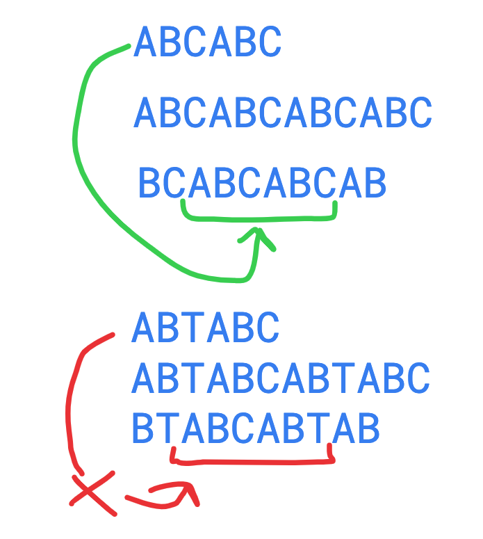

# Repeated Substring Pattern

[1]: https://leetcode.com/problems/repeated-substring-pattern/

## [LeetCode Problem][1]

&nbsp;

## Question

---

&nbsp;

Given a string s, check if it can be constructed by taking a substring of it and appending multiple copies of the substring together.

&nbsp;

### **Example:**

<!-- code below -->

```javascript

Input: s = "abab"
Output: true
Explanation: It is the substring "ab" twice.

```

&nbsp;

## Pseudo Code:

- If a string is made up of repeating substrings, that should apply also for the same string doubled
- We can then simply double the string in question, and remove a single character from the front and back of the array/string
- Next, check if the original string is contained within the new string, and if it is, we know that the string is made up of repeating substrings

&nbsp;

&nbsp;

## **Solution:**

<!-- code below -->

```javascript
var repeatedSubstringPattern = function (s) {
  let doubleStr = s.concat(s)
  doubleStr = doubleStr.slice(0, doubleStr.length - 1)
  doubleStr = doubleStr.slice(1, doubleStr.length)
  return doubleStr.includes(s)
}
```
